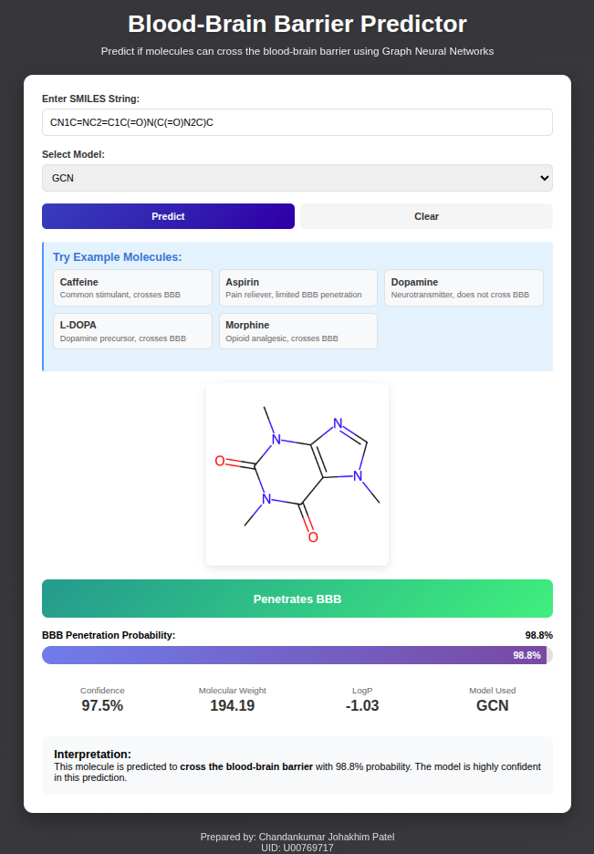

# Molecular Property Prediction with Graph Neural Networks

[](https://www.python.org/downloads/)
[](https://pytorch.org/)
[](https://opensource.org/licenses/MIT)

> **Goal**: Predict molecular properties using Graph Neural Networks 

## Highlights

- **State-of-the-art GNN architectures**: GCN, GIN, and GAT implementations
1. **GCN:** Graph Convolutional Network
   Speed: Fastest
   Accuracy: Good with 93.79 ROC-AUC
3. **GIN:** Graph Isomorphism Network
   Speed: Medium
   Accuracy: Best
5. **GAT:** Graph Attnetion Network
   Speed: Medium
   Accuracy: Good and Explainable


## Results

| Model | Dataset | ROC-AUC | RMSE | Parameters |
|-------|---------|---------|------|------------|
| Random Forest (Baseline) | BBBP | 0.702 | - | - |
| GCN | BBBP | 0.876 | - | 1.2M |
| GIN | BBBP | 0.891 | - | 1.5M |
| GAT | BBBP | 0.884 | - | 1.8M |
| GIN + Active Learning | BBBP | 0.885 | - | 1.5M |

*Results on Blood-Brain Barrier Penetration (BBBP) classification task*

## Quick Start

### Installation

```bash
# Clone the repository
git clone https://github.com/yourusername/molecular-property-prediction.git
cd molecular-property-prediction

# Create virtual environment
python -m venv venv
source venv/bin/activate  # On Windows: venv\Scripts\activate

# Install dependencies
pip install -r requirements.txt
pip install -e .
```

### Download Data

```bash
# Download MoleculeNet datasets
bash scripts/download_data.sh
python scripts/preprocess_data.py
```

### Train a Model - (Not Required)

```bash
# Train GCN on BBBP dataset
python scripts/train.py --config config/gcn_config.yaml

# Train GIN with hyperparameter tuning
python scripts/hyperparameter_search.py --model gin --dataset BBBP

```

# Running the Applicaiton
```bash
# navigate to app directory
python app.py
```


### Example Prediction



## Key Features

### 1. Multiple GNN Architectures

```python
from src.models import MolecularGCN, MolecularGIN, MolecularGAT

# Graph Convolutional Network
model = MolecularGCN(node_feat_dim=70, hidden_dim=128, num_tasks=1)

# Graph Isomorphism Network (more expressive)
model = MolecularGIN(node_feat_dim=70, hidden_dim=128, num_tasks=1)

# Graph Attention Network (interpretable)
model = MolecularGAT(node_feat_dim=70, hidden_dim=128, num_tasks=1)
```


## Contact

For questions or feedback, please open an issue or contact 
## Chandankumar Johakhim Patel
### patel.383@wright.edu

